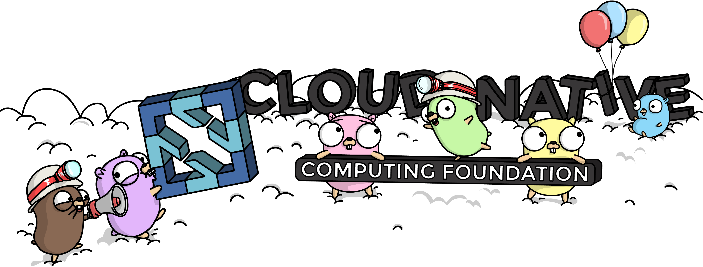

👋 **Hi Guys**

- 😊 I’m @Forget-C
- 👀 I’m interested in `k8s` `go` `python` 
- 🌱 I live in Beijing
- 💞️ I like open source culture
- 📫 How to reach me [www.cyisme.top](https://www.cyisme.top)

`😄 Share my technology.`
- [从源码解析KubeScheduler Framework插件](https://github.com/Forget-C/MyNotes/k8s/scheduler/framework/index.md)
- [从源码解析Attachdetach控制器](https://github.com/Forget-C/MyNotes/k8s/controller/attachdetach/index.md)
- [从源码解析KubeController Garbagecollector](https://github.com/Forget-C/MyNotes/k8s/controller/gc/index.md)
- [从源码解析VolcanoScheduler调度过程](https://github.com/Forget-C/MyNotes/volcano/flow/index.md)
- [从源码解析flannel](https://github.com/Forget-C/MyNotes/cni/flannel/index.md)
- [从源码解析Containerd容器启动流程](https://github.com/Forget-C/MyNotes/cri/containerd/run/index.md)
- [更多分享文章...](https://github.com/Forget-C/MyNotes)

`🌈 Projects to participate as contributors.`
- [https://github.com/robscott/kube-capacity](https://github.com/robscott/kube-capacity)
- [https://github.com/boz/kail](https://github.com/boz/kail)
- [https://github.com/pipe-cd/pipecd](https://github.com/pipe-cd/pipecd)

<!---
Forget-C/Forget-C is a ✨ special ✨ repository because its `README.md` (this file) appears on your GitHub profile.
You can click the Preview link to take a look at your changes.
--->
